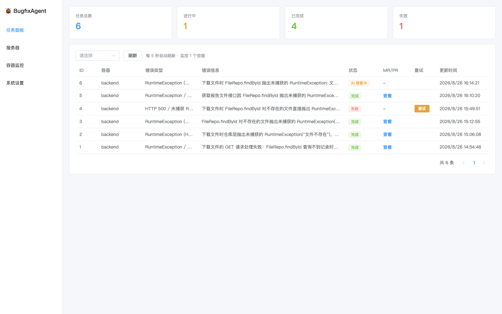
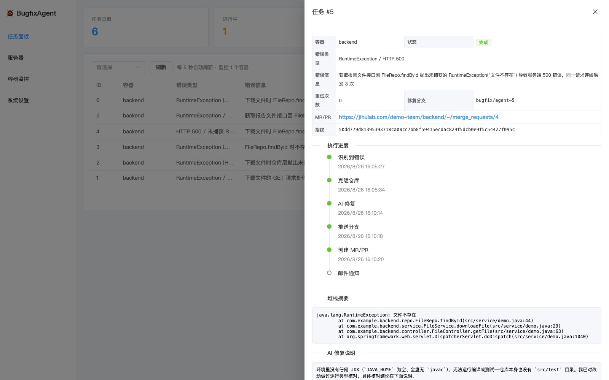
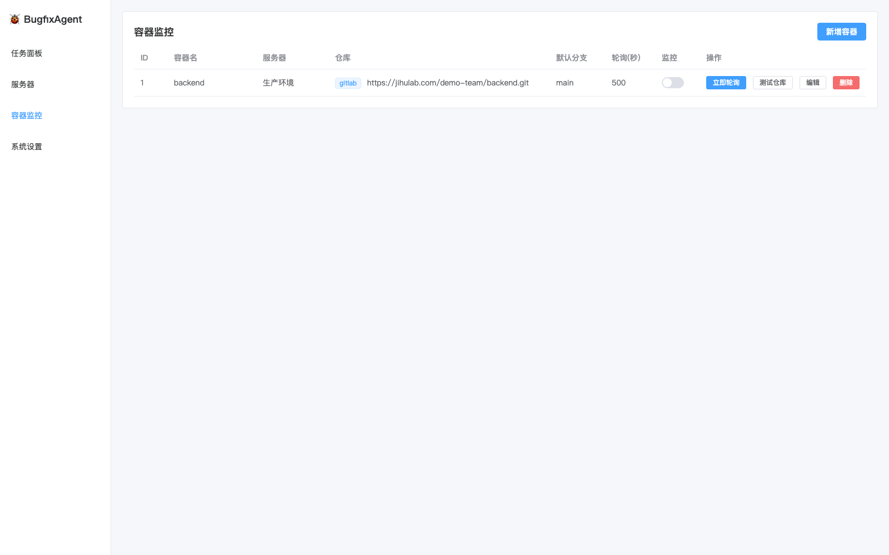
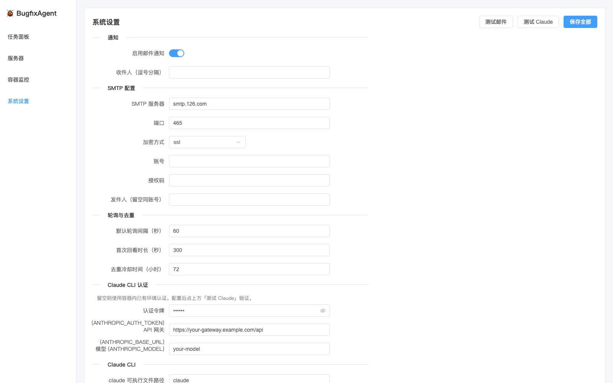

# BugfixAgent — 容器报错自动修复系统

监听远程服务器 Docker 容器的报错日志（如后端 500），自动完成：**AI 识别错误 → 拉取代码仓库 → Claude CLI 自动修复 → 推送分支并创建 MR/PR → 邮件通知**，并提供 Web 面板跟踪任务状态。

## 功能亮点

- 🔍 **自动巡检**：轮询远程服务器 `docker logs` 增量日志，Claude CLI 智能识别需要修复的服务端错误（自动忽略 4xx、噪音日志）
- 🧠 **AI 自动修复**：按容器绑定的仓库（极狐 GitLab / GitHub）克隆代码，Claude CLI 最小化修改并验证，推送 `bugfix/agent-*` 分支后自动创建 MR/PR
- 🔁 **指纹去重**：错误签名规范化 + 冷却期机制，同一报错不会反复触发修复；同容器串行执行避免冲突
- 📊 **Web 面板**：任务看板 + 各阶段执行时间线（识别→克隆→修复→推送→MR→通知）、一键重试、服务器/容器/设置全图形化管理
- 📧 **邮件通知**：修复结果（含 MR 链接）自动推送邮箱，开关与收件人可配置
- 🐳 **一键部署**：所有依赖（Python/Node/git/Claude CLI）打包进单个 Docker 镜像，SQLite 零外部依赖，本地构建 tar 传输即可上线

## 界面预览

| 任务面板 | 任务详情（时间线 / AI 修复说明） |
|:---:|:---:|
|  |  |

| 容器监控 | 系统设置 |
|:---:|:---:|
|  |  |

## 技术栈

Python (FastAPI + SQLAlchemy + SQLite + paramiko) · Vue 3 (Vite + TypeScript + Element Plus) · Claude CLI

## 快速开始

### 1. 后端

```bash
# 使用项目自带 .venv（或自建虚拟环境）
cd backend
pip install -r requirements.txt
uvicorn app.main:app --port 8787
```

首次启动会自动建表（`data/bugfix_agent.db`）并写入默认配置。

### 2. 前端

```bash
cd frontend
npm install
npm run dev          # http://localhost:5173（/api 已代理到 8787）
```

生产部署可 `npm run build`，后端会自动托管 `frontend/dist`，单端口访问。

### 3. 配置向导（Web 面板操作）

1. **服务器** 页：添加目标服务器（SSH IP/端口/用户名/密码），点"测试连接"验证。
2. **容器监控** 页：添加容器 —— 选择服务器、填容器名（`docker ps` 中的名字）、
   代码托管类型（极狐 GitLab / GitHub）、仓库 URL、访问 Token、默认分支、轮询间隔。
   "测试仓库"验证 token 可用，"立即轮询"手动触发一次采集分析。
3. **系统设置** 页：配置邮件通知（SMTP 授权码，126 邮箱示例默认值）、去重冷却时间、
   Claude CLI 认证与路径等。

### 4. 邮件通知（以 126 邮箱为例）

设置页填：`smtp.host=smtp.126.com`、`smtp.port=465`、`smtp.secure=ssl`、
`smtp.user=你的邮箱`、`smtp.pass=SMTP 授权码`（非登录密码，需在邮箱后台开启 SMTP 并生成）、
`notify.recipients=你的邮箱`。`notify.enabled` 控制是否通知，可点"发送测试邮件"验证。

## 工作流程

```
轮询 docker logs --since <锚点> --timestamps（增量，锚点存库，重启不丢）
  → Claude CLI 分析该时段日志，识别需修复的错误并生成规范化指纹
  → 指纹去重（同指纹存在进行中任务 或 完成未过冷却期 → 跳过）
  → clone 仓库 → bugfix/agent-<id> 分支 → Claude CLI 修复（无 diff 视为失败）
  → commit + push → 调 API 建 MR（GitLab）/ PR（GitHub）→ 邮件通知 → done
```

任务状态机：`detected → cloning → fixing → pushing → mr_created → notified → done`，任一阶段失败进入 `failed`，面板上一键重试。

## 防止同一报错反复修复

- AI 输出的错误指纹（错误类型+关键消息+文件:行，已去除时间戳/请求ID/动态数值）经后端再规范化后 sha256 入库。
- 新错误命中以下任一条件即跳过：同指纹任务**进行中**；同指纹任务已结束但仍在**冷却期**内（默认 72 小时，设置页可调）。
- 同一容器同时只允许一个进行中的任务，避免并发修复冲突。

## 安全说明

- SSH 密码 / 仓库 Token / SMTP 授权码使用 Fernet 加密落库；密钥来自环境变量
  `BUGFIX_AGENT_SECRET_KEY`，未设置时自动生成 `data/secret.key`（权限 600）。API 返回一律脱敏。
- Claude 修复使用 `--dangerously-skip-permissions`，仅在 `workspace/task_<id>/`
  一次性克隆副本内执行，修复失败/重试会重置该目录；请知悉此取舍。

## 目录结构

```
backend/   FastAPI 服务（routers / services / models / tests）
frontend/  Vue3 面板（Dashboard / 服务器 / 容器监控 / 设置）
data/      SQLite 数据库与密钥文件
workspace/ 修复用临时克隆目录
```

## 测试

```bash
cd backend
python -m pytest tests/ -q                 # 单元测试（指纹/JSON 解析/URL 解析）
python tests/integration_check.py          # 真实调用 claude CLI 的分析冒烟测试
python tests/fixer_pipeline_check.py       # 修复管线失败/重试路径测试
```

## Docker 部署

### CI 自动部署（推荐）

推送到 `main` 分支即自动完成：**GitHub Actions 构建镜像 → 推送 GHCR
（ghcr.io/zhkicode/bugfix-agent）→ SSH 到服务器拉取新镜像 → `docker compose up -d` → 健康检查**。

需要一次性配置 3 个仓库 Secrets（Settings → Secrets and variables → Actions）：

| Secret | 说明 |
|---|---|
| `ECS_HOST` | 服务器 IP |
| `ECS_USER` | SSH 用户名 |
| `ECS_SSH_KEY` | 部署专用私钥（公钥加入服务器 authorized_keys） |

也可在 Actions 页面手动触发（workflow_dispatch）。数据在 named volumes 中，
反复部署不丢失；面板配置（claude 认证等）存数据库，无需重复填写。

### 本地手动部署（备用）

```bash
cd BugfixAgent
docker buildx build --platform linux/amd64 -t bugfixagent:latest --load .
docker save bugfixagent:latest | gzip > ~/bugfixagent-image.tar.gz
rsync -azP ~/bugfixagent-image.tar.gz docker-compose.yml <server>:~/BugfixAgent/
ssh <server> 'cd ~/BugfixAgent && docker load < bugfixagent-image.tar.gz && \
  IMAGE=bugfixagent:latest docker compose up -d'
```

### 部署后配置（一次性）

- **Claude CLI**：打开 `http://<服务器IP>:8787` → 系统设置 → 「Claude CLI 认证」，
  填入 `ANTHROPIC_AUTH_TOKEN` / `ANTHROPIC_BASE_URL` / 模型名，保存后点「测试 Claude」验证。
  （令牌加密存库，界面不回显）
- **SMTP**：设置页配置后「测试邮件」。

### 说明

- 访问 `http://<服务器IP>:8787`（安全组需放行 8787；面板暂无鉴权，也可用
  `ssh -L 8787:localhost:8787 <server>` 隧道访问，不对外暴露端口）
- 数据持久化：named volumes —— `bugfix_data`（数据库+密钥+面板配置）、
  `bugfix_workspace`（修复克隆副本）、`agent_home`（claude 运行状态）
